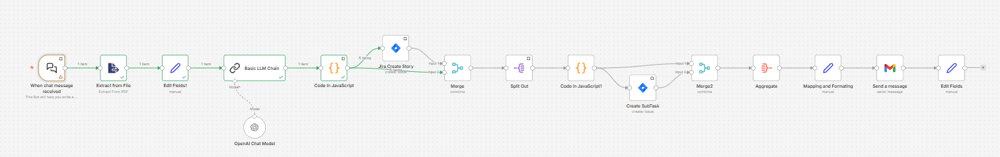
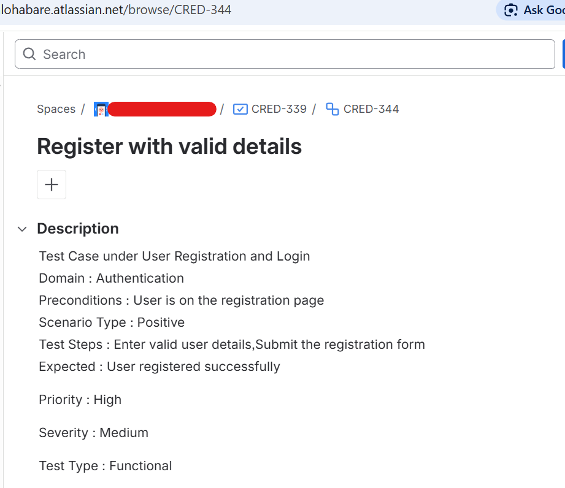
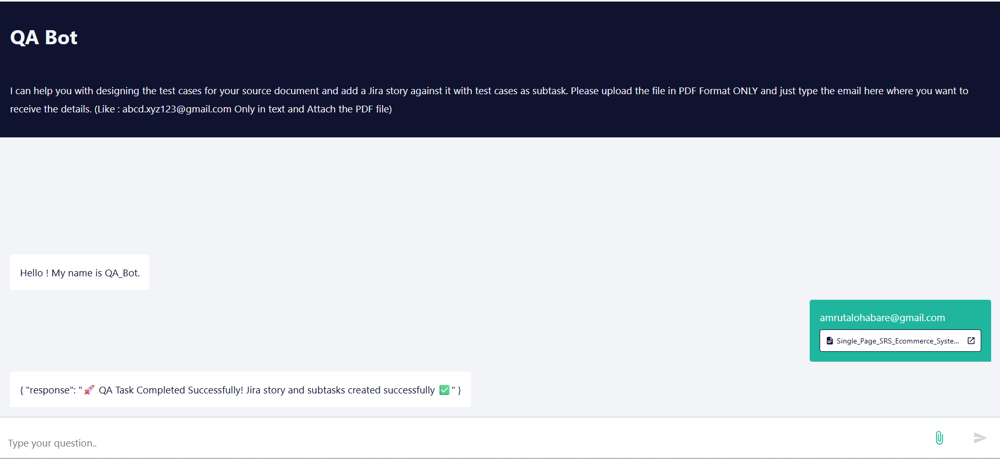
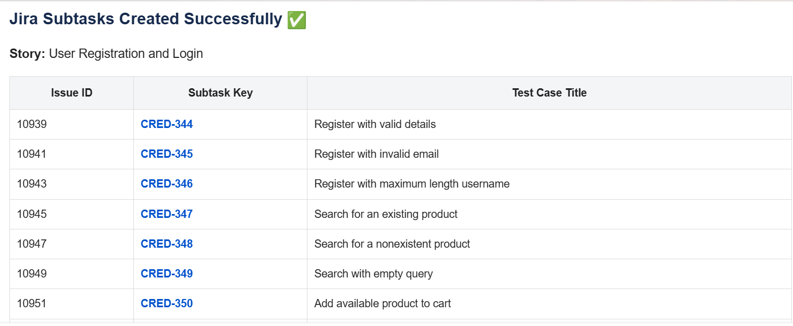

# AI-Powered QA Test Case Generator with Jira Integration (n8n)

## Overview

This project demonstrates an AI-driven QA automation system that generates structured test cases from SRS (Software Requirement Specification) documents and automatically creates corresponding Jira stories and subtasks.

The system was designed using n8n workflows, integrating AI (OpenAI LLM), Jira APIs, and automation logic to reduce manual QA effort and improve efficiency.

---

##  Problem Statement

In real-world QA processes:

* Test case creation from SRS documents is manual and time-consuming
* Translating requirements into structured test cases requires domain expertise
* Jira updates (stories + subtasks) are repetitive
* Lack of automation slows down delivery cycles

---

##  Solution

This system automates the entire QA flow:

1. Upload SRS document (PDF)
2. Extract content from file
3. Generate structured test cases using AI
4. Create Jira Story
5. Create Subtasks for each test case
6. Send results via email

---

## Key Features

*  SRS → Test Case generation using OpenAI LLM
*  Automated Jira Story & Subtask creation
*  End-to-end workflow automation using n8n
*  Email notification with execution summary
*  Scalable and reusable QA workflow

---

## Tech Stack

* n8n (Workflow Automation)
* OpenAI (LLM for test case generation)
* Jira REST API
* JavaScript (Custom transformation logic)
* Email Integration

---

## Workflow Summary

The workflow consists of the following sequence:

* Chat Trigger → Accepts user input and PDF file
* File Extraction → Reads SRS content
* Edit Fields → Prepares structured input
* LLM Chain (OpenAI) → Generates test cases
* JavaScript Node → Formats output
* Jira Create Story → Creates parent ticket
* Split Out → Iterates test cases
* Create Subtask → Creates individual test cases
* Merge + Aggregate → Combines results
* Mapping & Formatting → Prepares response
* Email Node → Sends execution summary

---

## Screenshots

## Sample Generated Test Case

**Title:** Register with valid details
**Domain:** Authentication
**Preconditions:** User is on the registration page

**Steps:**

1. Enter valid user details
2. Submit the registration form

**Expected Result:** User registered successfully

**Priority:** High
**Severity:** Medium

---

## 📊 Impact

* 🚀 Reduced manual test case creation effort
* ⚡ Accelerated QA lifecycle
* 🤖 Introduced AI-driven testing approach
* 🔍 Improved consistency in test design
* 🔗 Seamless Jira integration

---

## Use Cases

* QA teams working with SRS-driven development
* Agile teams needing faster test case generation
* AI adoption in QA workflows
* Jira-based test management systems

---

## ⚠️ Note

This project focuses on workflow design, AI integration, and QA automation strategy.
Sensitive credentials and original workflow exports are excluded for security reasons.

---

## Author

Amruta Lohabare
Senior QA Engineer | AI in Testing | Automation Enthusiast
